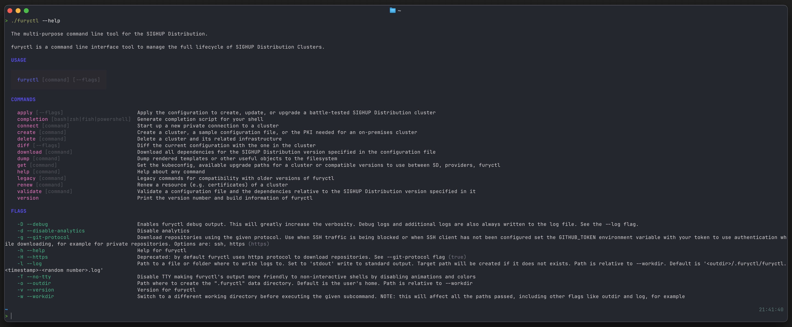
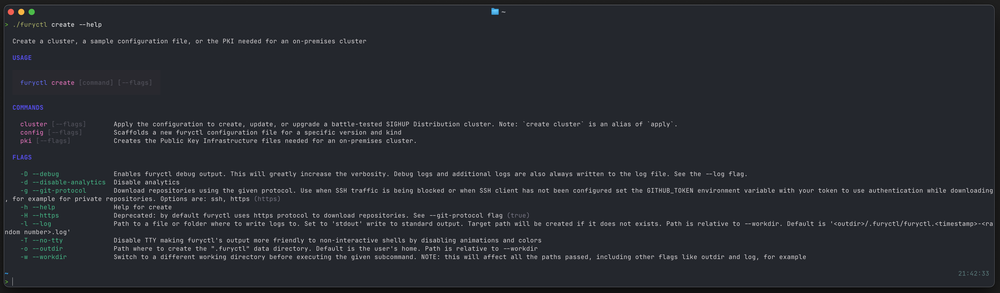
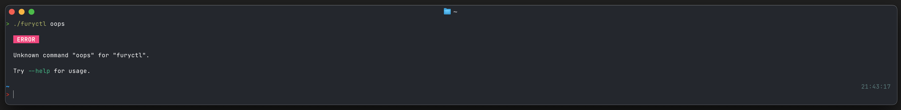

# Styled furyctl

Simple test with [Fang](https://github.com/charmbracelet/fang) lib to explore styled output and themeable UX

----

This is not an official code sample and is provided for demonstration purposes.